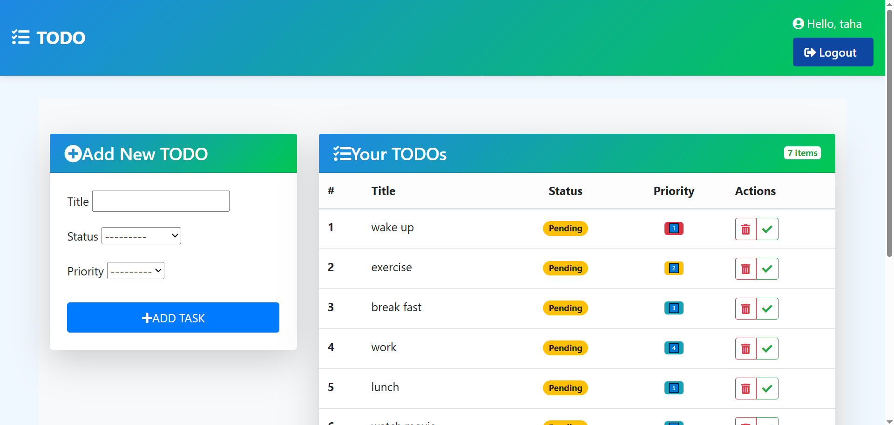

# 📝 TODO App - Your Productivity Companion  

  
*A sleek, intuitive task management solution built with Django and Bootstrap*  

---

## ✨ Features  

✔ **User Authentication** - Secure login/signup system  
✔ **Task Management** - Create, edit, delete tasks with ease  
✔ **Priority Control** - ⚡ High | ⏳ Medium | 💤 Low priority tagging  
✔ **Completion Tracking** - Check-off completed items  
✔ **Responsive Design** - Works flawlessly on all devices  

---

## 🛠 Installation  

### Prerequisites  
- Python 3.8+ 🐍  
- pip 📦  
- virtualenv (recommended)  

### 🚀 Quick Start  
```bash
# Clone repository
git clone https://github.com/muhammadtaha0022/TODO-app.git
cd TODO-app

# Setup virtual environment
python -m venv venv
source venv/bin/activate  # Windows: venv\Scripts\activate

# Install dependencies
pip install -r requirements.txt

# Configure database
python manage.py migrate

# Create admin (optional)
python manage.py createsuperuser

# Launch application
python manage.py runserver
